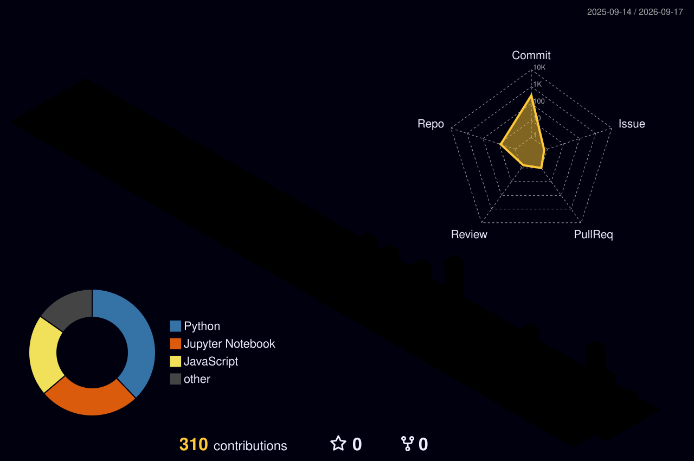

<!-- ──✦ CUSTOM ANIMATED HEADER ✦── -->

<svg viewBox="0 0 880 260" width="100%" xmlns="http://www.w3.org/2000/svg">
  <defs>
    <linearGradient id="bgGrad" x1="0%" y1="0%" x2="100%" y2="100%">
      <stop offset="0%" stop-color="#050505"/>
      <stop offset="60%" stop-color="#111111"/>
      <stop offset="100%" stop-color="#0a0a0a"/>
    </linearGradient>
    <linearGradient id="goldGrad" x1="0%" y1="0%" x2="100%" y2="0%">
      <stop offset="0%" stop-color="#b7a56a"/>
      <stop offset="100%" stop-color="#c9b37e"/>
    </linearGradient>
    <filter id="glow">
      <feGaussianBlur stdDeviation="2" result="coloredBlur"/>
      <feMerge>
        <feMergeNode in="coloredBlur"/>
        <feMergeNode in="SourceGraphic"/>
      </feMerge>
    </filter>
  </defs>

  <!-- Background -->
  <rect width="880" height="260" fill="url(#bgGrad)" rx="30"/>

  <!-- Particle grid (subtle tech feel) -->
  <g fill="#c9b37e" opacity="0.1">
    <circle cx="40" cy="30" r="1.5"><animate attributeName="opacity" values="0;0.6;0" dur="3s" repeatCount="indefinite"/></circle>
    <circle cx="150" cy="80" r="1"><animate attributeName="opacity" values="0;0.5;0" dur="2.5s" repeatCount="indefinite" begin="0.5s"/></circle>
    <circle cx="780" cy="50" r="1.8"><animate attributeName="opacity" values="0;0.7;0" dur="4s" repeatCount="indefinite" begin="1s"/></circle>
    <circle cx="700" cy="200" r="1.2"><animate attributeName="opacity" values="0;0.4;0" dur="3.5s" repeatCount="indefinite" begin="2s"/></circle>
    <circle cx="300" cy="220" r="1"><animate attributeName="opacity" values="0;0.6;0" dur="2.8s" repeatCount="indefinite" begin="0.2s"/></circle>
    <circle cx="500" cy="40" r="1.5"><animate attributeName="opacity" values="0;0.5;0" dur="3.2s" repeatCount="indefinite" begin="1.8s"/></circle>
  </g>

  <!-- Abstract VK monogram -->
  <g transform="translate(40, 60)" filter="url(#glow)">
    <!-- V -->
    <path d="M 15 10 L 35 60 L 55 10" stroke="url(#goldGrad)" stroke-width="7" fill="none" stroke-linecap="round" stroke-linejoin="round">
      <animate attributeName="stroke-dasharray" from="0 150" to="150 0" dur="1.5s" fill="freeze"/>
    </path>
    <!-- K -->
    <g transform="translate(70, 0)">
      <path d="M 10 10 L 10 60 M 10 35 L 35 10 M 10 35 L 35 60" stroke="url(#goldGrad)" stroke-width="7" fill="none" stroke-linecap="round" stroke-linejoin="round">
        <animate attributeName="stroke-dasharray" from="0 120" to="120 0" dur="1.5s" begin="0.8s" fill="freeze"/>
      </path>
    </g>
  </g>

  <!-- Name with fade-in -->
  <text x="250" y="135" font-family="Georgia, serif" font-size="48" font-weight="bold" fill="#e8e3d3" letter-spacing="4" opacity="0">
    Vishwas Kothari
    <animate attributeName="opacity" from="0" to="1" dur="2s" begin="1.5s" fill="freeze"/>
  </text>

  <!-- Decorative line -->
  <line x1="250" y1="155" x2="620" y2="155" stroke="#c9b37e" stroke-width="1.5" opacity="0">
    <animate attributeName="opacity" from="0" to="1" dur="1s" begin="2.2s" fill="freeze"/>
  </line>

  <!-- Subtitle -->
  <text x="435" y="185" font-family="'Courier New', monospace" font-size="15" fill="#9caf88" text-anchor="middle" opacity="0" letter-spacing="2">
    Explainable AI  •  Research  •  Data Engineering
    <animate attributeName="opacity" from="0" to="1" dur="1.5s" begin="2.8s" fill="freeze"/>
  </text>
</svg>

 
 

<!-- Dynamic typing (kept from original) -->

 

<!-- Social badges -->

 

---

### ✦ Philosophy

<!-- HTML quote box – works perfectly on any screen -->

  <table style="border-collapse: collapse; border: 2px solid #c9b37e; border-radius: 12px; background-color: #0d0d0d; padding: 15px 25px; display: inline-block;">
    <tr>
      <td style="color: #e8e3d3; font-family: 'Courier New', monospace; font-size: 14px; line-height: 1.6; text-align: center; padding: 10px;">
        “I believe machine learning should not only predict but 
        justify its reasoning — turning black‑box models into 
        systems that are <strong>inspectable</strong>, <strong>auditable</strong>, and <strong>trustworthy</strong>.”
      </td>
    </tr>
  </table>

I’m **Vishwas Kothari** — a CS graduate student and AI researcher bridging **explainable AI**, **data engineering**, **vision‑language models**, and **optimizer behaviour**. I’ve interned at ISRO’s Space Applications Centre and published on ethical AI. I build ML artifacts that people can **read, question, and rely on**.

 

---

### ✦ Research Universe

<!-- Custom mind‑map SVG -->

<svg viewBox="0 0 720 360" width="75%" xmlns="http://www.w3.org/2000/svg">
  <defs>
    <radialGradient id="coreGrad" cx="50%" cy="50%" r="50%">
      <stop offset="0%" stop-color="#c9b37e"/>
      <stop offset="100%" stop-color="#050505"/>
    </radialGradient>
  </defs>

  <circle cx="360" cy="180" r="32" fill="url(#coreGrad)" stroke="#c9b37e" stroke-width="1.5"/>
  <text x="360" y="186" text-anchor="middle" fill="#050505" font-size="11" font-weight="bold" font-family="monospace">CORE</text>

  <!-- Connections -->
  <g stroke="#9caf88" stroke-width="1.2" opacity="0.7">
    <line x1="360" y1="148" x2="360" y2="50"/>
    <line x1="360" y1="212" x2="360" y2="310"/>
    <line x1="328" y1="180" x2="120" y2="120"/>
    <line x1="392" y1="180" x2="600" y2="120"/>
    <line x1="340" y1="200" x2="220" y2="290"/>
  </g>

  <!-- Nodes -->
  <rect x="310" y="20" width="100" height="30" rx="8" fill="#111" stroke="#c9b37e" stroke-width="1"/>
  <text x="360" y="39" text-anchor="middle" fill="#e8e3d3" font-size="10" font-family="monospace">Explainable AI</text>

  <rect x="310" y="310" width="100" height="30" rx="8" fill="#111" stroke="#c9b37e" stroke-width="1"/>
  <text x="360" y="329" text-anchor="middle" fill="#e8e3d3" font-size="10" font-family="monospace">ML Research</text>

  <rect x="50" y="105" width="120" height="30" rx="8" fill="#111" stroke="#c9b37e" stroke-width="1"/>
  <text x="110" y="124" text-anchor="middle" fill="#e8e3d3" font-size="10" font-family="monospace">Data Engineering</text>

  <rect x="550" y="105" width="120" height="30" rx="8" fill="#111" stroke="#c9b37e" stroke-width="1"/>
  <text x="610" y="124" text-anchor="middle" fill="#e8e3d3" font-size="10" font-family="monospace">Vision‑Language</text>

  <rect x="160" y="270" width="110" height="30" rx="8" fill="#111" stroke="#c9b37e" stroke-width="1"/>
  <text x="215" y="289" text-anchor="middle" fill="#e8e3d3" font-size="10" font-family="monospace">Fairness &amp; Trust</text>
</svg>

 

---

### ✦ Experience Timeline

<svg viewBox="0 0 700 260" width="85%" xmlns="http://www.w3.org/2000/svg">
  <!-- Vertical line -->
  <line x1="200" y1="40" x2="200" y2="230" stroke="#c9b37e" stroke-width="1.5" stroke-dasharray="5,3"/>

  <!-- Node 1 -->
  <circle cx="200" cy="60" r="8" fill="#9caf88" stroke="#050505" stroke-width="2"/>
  <text x="225" y="52" fill="#e8e3d3" font-size="12" font-family="monospace" font-weight="bold">Research Intern</text>
  <text x="225" y="68" fill="#a6a092" font-size="10" font-family="monospace">Space Applications Centre – ISRO</text>
  <text x="175" y="78" fill="#c9b37e" font-size="9" font-family="monospace" text-anchor="end">2024</text>
  <foreignObject x="230" y="80" width="440" height="40">
    

      Python pipelines for satellite sensor data, NetCDF merging, cross‑sensor validation.
    

  </foreignObject>

  <!-- Node 2 -->
  <circle cx="200" cy="160" r="8" fill="#9caf88" stroke="#050505" stroke-width="2"/>
  <text x="225" y="152" fill="#e8e3d3" font-size="12" font-family="monospace" font-weight="bold">Professional Master’s in CS</text>
  <text x="225" y="168" fill="#a6a092" font-size="10" font-family="monospace">University of Colorado Boulder</text>
  <text x="175" y="178" fill="#c9b37e" font-size="9" font-family="monospace" text-anchor="end">2023 – 2025</text>

  <!-- Node 3 -->
  <circle cx="200" cy="230" r="8" fill="#9caf88" stroke="#050505" stroke-width="2"/>
  <text x="225" y="222" fill="#e8e3d3" font-size="12" font-family="monospace" font-weight="bold">Publication &amp; Peer Review</text>
  <text x="225" y="238" fill="#a6a092" font-size="10" font-family="monospace">Springer &amp; Elsevier</text>
  <text x="175" y="248" fill="#c9b37e" font-size="9" font-family="monospace" text-anchor="end">2024</text>
</svg>

 

---

### ✦ Publication Highlight

<svg viewBox="0 0 680 140" width="85%" xmlns="http://www.w3.org/2000/svg">
  <rect x="10" y="10" width="660" height="120" rx="14" fill="#0d0d0d" stroke="#c9b37e" stroke-width="1.2"/>
  <text x="30" y="38" fill="#c9b37e" font-size="14" font-family="Georgia, serif" font-weight="bold">Empowering Survivors</text>
  <text x="30" y="58" fill="#a6a092" font-size="11" font-family="monospace">Ethical Artificial Intelligence for Countering Violence Against Women</text>
  <text x="30" y="80" fill="#9caf88" font-size="10" font-family="monospace">Springer • Data Mining and Information Security</text>
  <a href="https://doi.org/10.1007/978-981-96-6046-9_26" target="_blank">
    <text x="30" y="102" fill="#e8e3d3" font-size="10" font-family="monospace" text-decoration="underline">DOI: 10.1007/978-981-96-6046-9_26</text>
  </a>
  <text x="420" y="85" fill="#a6a092" font-size="10" font-family="monospace" opacity="0.8">▶ Abstract inside repository</text>
</svg>

  
📄 Abstract

  

    The maltreatment of women is a problem that affects all countries. Prevention, intervention, and support are among the many uses that can be provided through artificial intelligence. This paper discusses how artificial intelligence can be used ethically in the fight against VAWs. One way is through chatbots which could guide victims toward resources and legal remedies without having to reveal their identity. Furthermore, by sifting through information collected from different sources, such systems may also help identify risk factors or predict where violence might occur next. In any case, we must always remember about the privacy concerns when it comes to handling sensitive data thus while designing such approaches, fairness issues should also be taken into consideration so that some degree of human control remains. AI should not only support our global efforts to end violence against women but also empower survivors.
  

 

---

### ✦ Project Cards

<svg viewBox="0 0 960 200" width="100%" xmlns="http://www.w3.org/2000/svg">
  <!-- Card 1 -->
  <rect x="10" y="10" width="300" height="180" rx="12" fill="#0d0d0d" stroke="#9caf88" stroke-width="1.2"/>
  <text x="160" y="45" text-anchor="middle" fill="#c9b37e" font-size="14" font-family="monospace" font-weight="bold">XAI Credit Lens</text>
  <text x="160" y="70" text-anchor="middle" fill="#a6a092" font-size="10" font-family="monospace">Explainable credit risk</text>
  <text x="30" y="110" fill="#e8e3d3" font-size="12" font-family="monospace">SHAP, LIME, DiCE</text>
  <text x="30" y="130" fill="#e8e3d3" font-size="12" font-family="monospace">Fairness auditing</text>
  <text x="30" y="150" fill="#e8e3d3" font-size="12" font-family="monospace">Regulatory mapping</text>
  <a href="https://github.com/vishwas182002/XAI-Credit-Lens" target="_blank">
    <text x="160" y="175" text-anchor="middle" fill="#9caf88" font-size="10" font-family="monospace" text-decoration="underline">View on GitHub ↗</text>
  </a>

  <!-- Card 2 -->
  <rect x="330" y="10" width="300" height="180" rx="12" fill="#0d0d0d" stroke="#9caf88" stroke-width="1.2"/>
  <text x="480" y="45" text-anchor="middle" fill="#c9b37e" font-size="14" font-family="monospace" font-weight="bold">Financial Doc VQA</text>
  <text x="480" y="70" text-anchor="middle" fill="#a6a092" font-size="10" font-family="monospace">Vision‑language models</text>
  <text x="350" y="110" fill="#e8e3d3" font-size="12" font-family="monospace">SEC 10‑K filings</text>
  <text x="350" y="130" fill="#e8e3d3" font-size="12" font-family="monospace">LoRA fine‑tuning</text>
  <text x="350" y="150" fill="#e8e3d3" font-size="12" font-family="monospace">Domain benchmarks</text>
  <a href="https://github.com/vishwas182002/Financial-Document-VQA" target="_blank">
    <text x="480" y="175" text-anchor="middle" fill="#9caf88" font-size="10" font-family="monospace" text-decoration="underline">View on GitHub ↗</text>
  </a>

  <!-- Card 3 -->
  <rect x="650" y="10" width="300" height="180" rx="12" fill="#0d0d0d" stroke="#9caf88" stroke-width="1.2"/>
  <text x="800" y="45" text-anchor="middle" fill="#c9b37e" font-size="14" font-family="monospace" font-weight="bold">Adam vs. SGD Bias</text>
  <text x="800" y="70" text-anchor="middle" fill="#a6a092" font-size="10" font-family="monospace">Optimizer behavior</text>
  <text x="670" y="110" fill="#e8e3d3" font-size="12" font-family="monospace">Max‑margin solutions</text>
  <text x="670" y="130" fill="#e8e3d3" font-size="12" font-family="monospace">Optimizer geometry</text>
  <text x="670" y="150" fill="#e8e3d3" font-size="12" font-family="monospace">Spurious correlations</text>
  <a href="https://github.com/vishwas182002/Implicit-Bias-Adam-SGD" target="_blank">
    <text x="800" y="175" text-anchor="middle" fill="#9caf88" font-size="10" font-family="monospace" text-decoration="underline">View on GitHub ↗</text>
  </a>
</svg>

 

---

### ✦ Skill Radar

<svg viewBox="0 0 360 360" width="50%" xmlns="http://www.w3.org/2000/svg">
  <defs>
    <polygon id="pentagon" points="180,30 310,130 260,300 100,300 50,130" fill="none" stroke="#333" stroke-width="1"/>
  </defs>
  <use href="#pentagon" transform="scale(0.8) translate(45, 45)" stroke="#555"/>
  <use href="#pentagon" transform="scale(0.6) translate(90, 90)" stroke="#555"/>
  <use href="#pentagon" transform="scale(0.4) translate(135, 135)" stroke="#555"/>
  <use href="#pentagon" transform="scale(0.2) translate(180, 180)" stroke="#555"/>

  <!-- Data polygon (proficiency) -->
  <polygon points="180,55 280,140 255,280 105,280 80,140" fill="#c9b37e" fill-opacity="0.15" stroke="#c9b37e" stroke-width="1.8"/>

  <!-- Axis labels -->
  <text x="180" y="20" text-anchor="middle" fill="#e8e3d3" font-size="11" font-family="monospace">Python</text>
  <text x="335" y="135" text-anchor="start" fill="#e8e3d3" font-size="11" font-family="monospace">PyTorch</text>
  <text x="265" y="315" text-anchor="middle" fill="#e8e3d3" font-size="11" font-family="monospace">XAI</text>
  <text x="35" y="315" text-anchor="middle" fill="#e8e3d3" font-size="11" font-family="monospace">Data Eng.</text>
  <text x="5" y="135" text-anchor="end" fill="#e8e3d3" font-size="11" font-family="monospace">Deployment</text>
</svg>

 

### ✦ Tech Stack

  

  
  
  

 

---

### ✦ GitHub Skyline (a city built from your contributions)

  

    <pre style="color: #e8e3d3; font-family: 'Courier New', monospace; font-size: 13px; line-height: 1.3; background: transparent; border: none; margin: 0; white-space: pre;">
      ▲
     /|\
    / | \
   /  |  \
    </pre>
    

      Explore your 3D contribution city at: 
      <a href="https://skyline.github.com/vishwas182002/2024" style="color: #9caf88; font-weight: bold;">skyline.github.com/vishwas182002/2024</a>
    

  

 

---

<h2 align="center">✦ Contribution Map &amp; Analytics ✦</h2>

  

  

  

  

  
  
  

  

