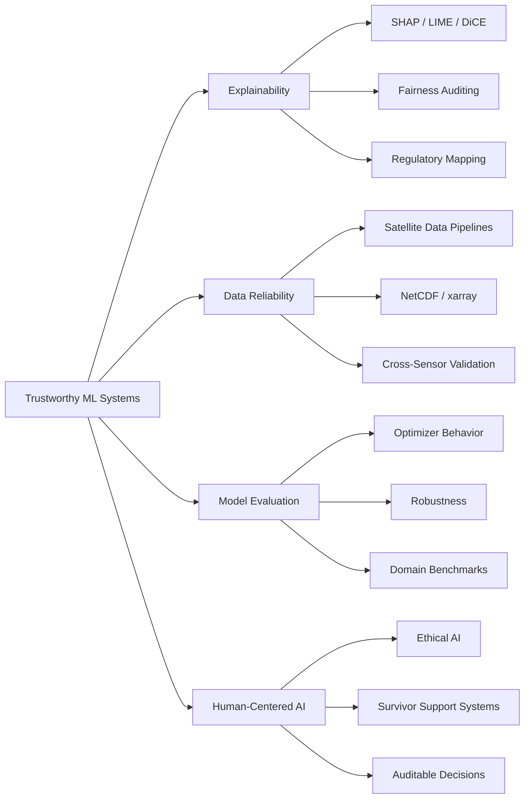
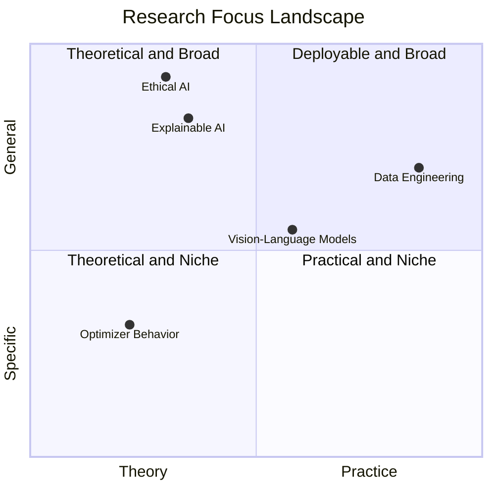
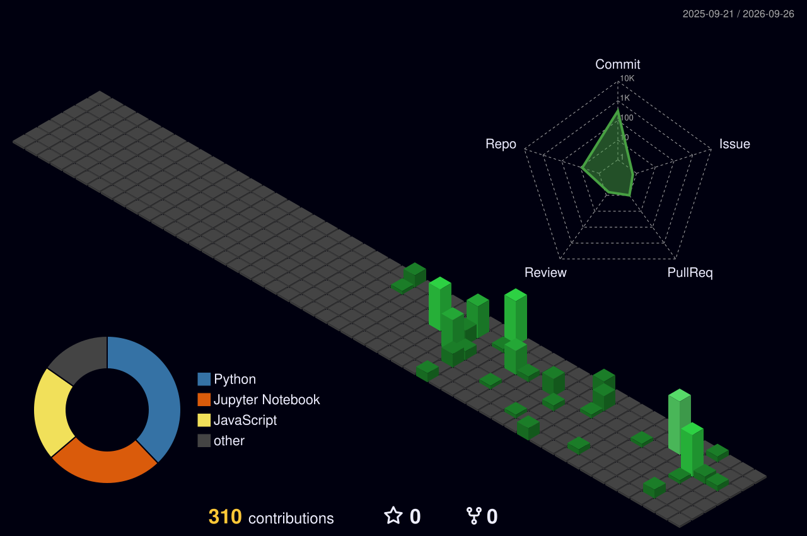

  

  

  
  
  

 

## Research Thesis

> I build machine learning systems that do more than predict.  
> They should explain their reasoning, expose their limits, and remain inspectable by the people who depend on them.

I'm **Vishwas Kothari**, a CS graduate student and AI researcher working across **explainable AI**, **data engineering**, **vision-language models**, and **ML research**. My experience includes research work at **ISRO's Space Applications Centre**, a Springer publication on ethical AI, and applied projects in financial AI, document understanding, optimizer behavior, and model trust.

 

## Research System

 

## Focus Areas

  
  
  

  
  

 

## Experience

<table>
  <tr>
    <td width="34%">
      <strong>Research Intern</strong> 
      Space Applications Centre - ISRO
    </td>
    <td>
      Built Python pipelines for satellite sensor data processing, NetCDF merging, optimization, and cross-sensor validation.
    </td>
  </tr>
  <tr>
    <td width="34%">
      <strong>Professional Master's in CS</strong> 
      University of Colorado Boulder
    </td>
    <td>
      Graduate work focused on machine learning, interpretability, research systems, and real-world deployment.
    </td>
  </tr>
  <tr>
    <td width="34%">
      <strong>Publication &amp; Peer Review</strong> 
      Springer &middot; Elsevier
    </td>
    <td>
      Springer book chapter on ethical AI and peer-review work with Elsevier journals.
    </td>
  </tr>
</table>

 

## Publication

<table>
  <tr>
    <td width="34%">
      <strong>Empowering Survivors</strong> 
      Ethical Artificial Intelligence for Countering Violence Against Women  
      <a href="https://doi.org/10.1007/978-981-96-6046-9_26">DOI: 10.1007/978-981-96-6046-9_26</a>
    </td>
    <td>
      Springer book chapter in <em>Data Mining and Information Security</em>, focused on ethical AI systems for survivor support, privacy-aware intervention, and risk identification.
      

        
<strong>Abstract</strong>

        

          The maltreatment of women is a problem that affects all countries. Prevention, intervention, and support are among the many uses that can be provided through artificial intelligence. This paper discusses how artificial intelligence can be used ethically in the fight against VAWs. One way is through chatbots which could guide victims toward resources and legal remedies without having to reveal their identity. Furthermore, by sifting through information collected from different sources, such systems may also help identify risk factors or predict where violence might occur next. In any case, we must always remember about the privacy concerns when it comes to handling sensitive data thus while designing such approaches, fairness issues should also be taken into consideration so that some degree of human control remains. AI should not only support our global efforts to end violence against women but also empower survivors.
        

      

    </td>
  </tr>
</table>

 

## Selected Work

<table>
  <tr>
    <td width="34%">
      <a href="https://github.com/vishwas182002/XAI-Credit-Lens"><strong>XAI Credit Lens</strong></a> 
      Explainable credit risk
    </td>
    <td>
      Built an explainable credit-risk workflow using SHAP, LIME, DiCE, fairness auditing, and regulatory mapping for transparent model decisions.
    </td>
  </tr>
  <tr>
    <td width="34%">
      <a href="https://github.com/vishwas182002/Financial-Document-VQA"><strong>Financial Document VQA</strong></a> 
      Vision-language models
    </td>
    <td>
      Benchmarked vision-language models on SEC 10-K filings and improved domain performance with LoRA fine-tuning.
    </td>
  </tr>
  <tr>
    <td width="34%">
      <a href="https://github.com/vishwas182002/Implicit-Bias-Adam-SGD"><strong>Implicit Bias of Adam vs. SGD</strong></a> 
      Optimizer behavior
    </td>
    <td>
      Studied max-margin solutions, optimizer geometry, and patched-MNIST spurious correlations to compare Adam and SGD behavior.
    </td>
  </tr>
</table>

 

## Technical Stack

  

  
  
  

 

## Research Compass

 

## Contribution Constellation

  

  

  

  

  
  
  

  

  

