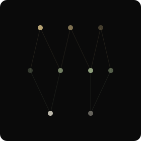

  

  

  
  
  

 

<h2 align="left">About</h2>

<table>
  <tr>
    <td width="62%" valign="top">
      

        I'm <strong>Vishwas Kothari</strong>, a CS graduate student and AI researcher focused on building machine learning systems that are not only accurate, but <strong>understandable and trustworthy</strong>.
      

      

        My work spans explainable AI, data engineering, vision-language models, and ML research, with experience at <strong>ISRO's Space Applications Centre</strong> and projects across financial AI, optimizer behavior, and robustness.
      

      

        I care about turning complex ideas into systems people can inspect, question, and rely on.
      

       
      

        
        
        
      

    </td>
    <td width="38%" align="center" valign="middle">
      
       
      <em>Research topology</em>
    </td>
  </tr>
</table>

 

<h2 align="left">Research Vectors</h2>

  
  
  

  
  

 

<h2 align="left">Core Systems</h2>

  

  
  
  

 

<h2 align="left">Signal Path</h2>

<table>
  <tr>
    <td width="30%"><strong>Research Intern</strong> Space Applications Centre — ISRO</td>
    <td>Built Python pipelines for satellite sensor data processing, NetCDF merging, optimization, and cross-sensor validation.</td>
  </tr>
  <tr><td colspan="2"></td></tr>
  <tr>
    <td width="30%"><strong>Professional Master's in CS</strong> University of Colorado Boulder</td>
    <td>Graduate work focused on machine learning, interpretability, and real-world deployment.</td>
  </tr>
  <tr><td colspan="2"></td></tr>
  <tr>
    <td width="30%"><strong>Publication & Peer Review</strong> Springer · Elsevier</td>
    <td>Springer publication on ethical AI and peer-review work with Elsevier journals.</td>
  </tr>
</table>

 

<h2 align="left">Published Signal</h2>

<table>
  <tr>
    <td width="32%">
      <strong>Empowering Survivors</strong> 
      Ethical Artificial Intelligence for Countering Violence Against Women  
      <a href="https://doi.org/10.1007/978-981-96-6046-9_26">DOI: 10.1007/978-981-96-6046-9_26</a>
    </td>
    <td>
      Springer book chapter in <em>Data Mining and Information Security</em>, focused on ethical AI systems for survivor support, privacy-aware intervention, and risk identification.
      

        
<strong>Abstract</strong>

        
The maltreatment of women is a problem that affects all countries. Prevention, intervention, and support are among the many uses that can be provided through artificial intelligence. This paper discusses how artificial intelligence can be used ethically in the fight against VAWs. One way is through chatbots which could guide victims toward resources and legal remedies without having to reveal their identity. Furthermore, by sifting through information collected from different sources, such systems may also help identify risk factors or predict where violence might occur next. In any case, we must always remember about the privacy concerns when it comes to handling sensitive data thus while designing such approaches, fairness issues should also be taken into consideration so that some degree of human control remains. AI should not only support our global efforts to end violence against women but also empower survivors.

      

    </td>
  </tr>
</table>

 

<h2 align="left">Deployed Models</h2>

<table>
  <tr>
    <td width="34%">
      <a href="https://github.com/vishwas182002/XAI-Credit-Lens"><strong>XAI Credit Lens</strong></a> 
      Explainable credit risk
    </td>
    <td>SHAP, LIME, DiCE, fairness auditing, and regulatory mapping for transparent credit-risk decisions.</td>
  </tr>
  <tr><td colspan="2"></td></tr>
  <tr>
    <td width="34%">
      <a href="https://github.com/vishwas182002/Financial-Document-VQA"><strong>Financial Document VQA</strong></a> 
      Vision-language models
    </td>
    <td>Benchmarked models on SEC 10-K filings and improved domain performance with LoRA.</td>
  </tr>
  <tr><td colspan="2"></td></tr>
  <tr>
    <td width="34%">
      <a href="https://github.com/vishwas182002/Implicit-Bias-Adam-SGD"><strong>Implicit Bias of Adam vs. SGD</strong></a> 
      Optimizer behavior
    </td>
    <td>Studied max-margin solutions, optimizer geometry, and patched-MNIST spurious correlations.</td>
  </tr>
</table>

 

<h2 align="left">Activity</h2>

  

 

  

